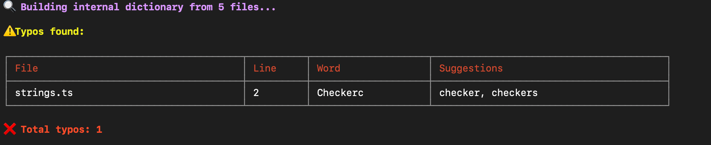
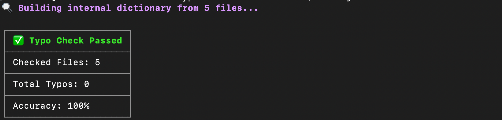

# Typo Checker

A powerful command-line tool and library to find typos in your JavaScript, TypeScript, JSX, and TSX source code files by analyzing string literals using AST parsing and spell-checking with [nspell](https://github.com/wooorm/nspell).

---

## Features

- File discovery: Uses fast-glob to find all JS/TS source files.
- Parses JS/TS/JSX/TSX files and analyzes string literals only.
- Uses robust AST parsing (`@typescript-eslint/typescript-estree`) to precisely locate strings and their line numbers.
- Uses `nspell` with English dictionary for spell checking.
- Builds a project-specific dictionary of known correct words for context-aware validation.
- Supports a configurable whitelist of allowed words and technical terms.
- Filters out acronyms, short words, and known technical terms from typo results.
- Suggests corrections for detected typos.
- Displays results in a clear CLI table with file, line, typo word, and suggestions.
- Usable as both a standalone CLI tool or as a programmatic library.

---

## Installation

```bash
npm install typo-checker
```
OR with yarn
```bash
yarn add typo-checker
```

## Configuration
In your project’s package.json, add:

```bash
"scripts": {
  "typo-checker": "typo-checker"
}
```

You can customize the whitelist of allowed words (to reduce false positives) by creating a ```typo-checker.config.json``` in your project root:

```bash
{
  "whitelist": [
    "React",
    "Redux",
    "NodeJS",
    "GraphQL",
    "uuid",
    "TSConfig"
  ]
}

```
Alternatively, add it inside your ```package.json```:
```bash
{
  "typoChecker": {
    "whitelist": [
      "React",
      "Redux",
      "NodeJS"
    ]
  }
}

```

## Example Output



If no typos are found:



---

## Development

- Built with TypeScript.
- Uses ES modules.
- Dependencies: `fast-glob`, `chalk`, `cli-table3, nspell`, `dictionary-en`, `@typescript-eslint/typescript-estree` `natural`.

---

## Limitations & Notes

- Parses JS/TS/JSX/TSX files and analyzes string literals only.
- Only checks string literals inside source code — does not analyze comments or identifiers.
- Works best for English text.
- Whitelist is critical to avoid noise from domain-specific words.
- Acronyms and short words are ignored.
- Handles US/UK spelling variants gracefully, avoiding false positives.

---

## Contributing
Feel free to open issues or PRs for new utility suggestions or improvements.

## License
MIT
